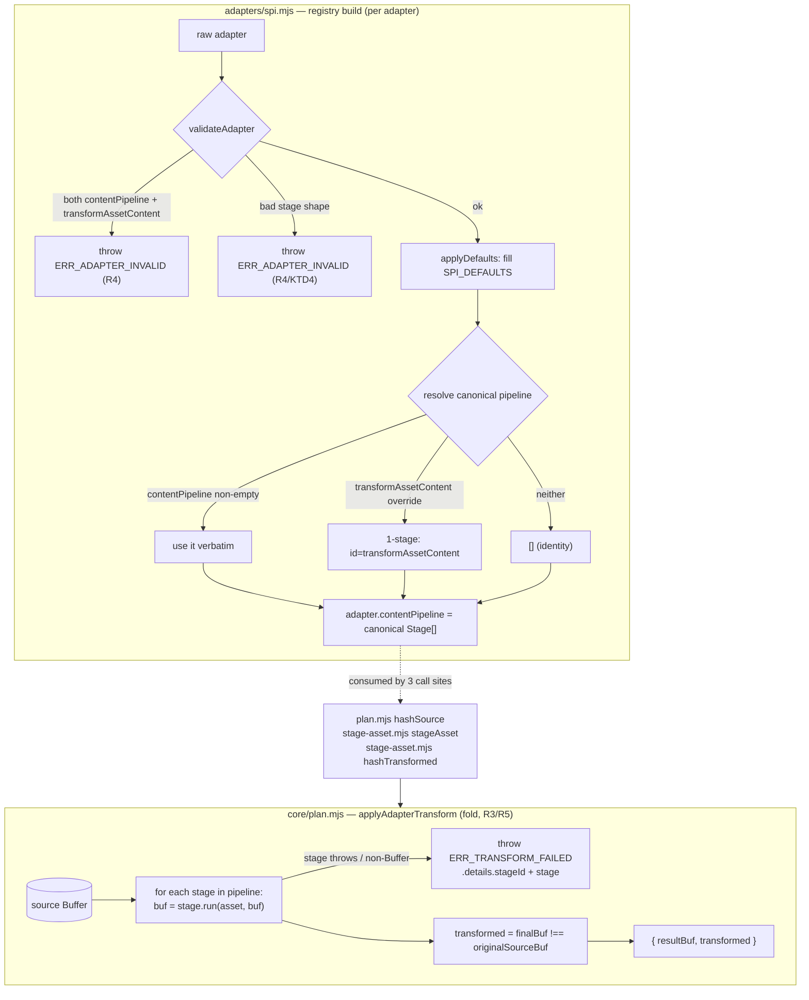

# feat: contentPipeline SPI v1.3 — stackable ordered content transforms

## Summary

Evolve the adapter SPI from a single `transformAssetContent` content-rewrite
hook (v1.2) to an optional ordered `contentPipeline: Stage[]` (v1.3). Purely
additive minor per ADR-0010: every existing v1.1/v1.2 adapter keeps working via
auto-promotion (a declared single hook becomes a synthetic 1-stage pipeline)
and no-hook adapters resolve to an empty (identity) pipeline. The change is
contained to the adapter-preparation step (`adapters/spi.mjs`) and the single
existing transform chokepoint (`core/plan.mjs` `applyAdapterTransform`), with
mechanical call-site updates in `core/stage-asset.mjs`. Scope is locked by
ADR-0020; this plan is HOW, not WHAT.

---

## Problem Frame

`transformAssetContent: (asset, body: Buffer) => Buffer` (ADR-0002) is a single
per-adapter hook with no composition seam. An adapter or downstream product
cannot stack two independent transforms (e.g. frontmatter-prefix rewrite +
annotation inject + cross-CLI sanitizer) without hand-merging them into one
opaque function. The hook is invoked at exactly one chokepoint —
`applyAdapterTransform` in `core/plan.mjs`, composed by `hashTransformed`
(plan-side, no write) and `stageAsset` (stage-side, writes) in
`core/stage-asset.mjs`. Today the only non-identity implementation is
`adapters/opencode.mjs` (Claude→OpenCode agent frontmatter translation).

We want stackable, individually-named transforms **without** breaking any
existing adapter and **without** building speculative phase machinery.

---

## Requirements

Traceable to ADR-0020 decisions (D1-D4):

- **R1 (D1):** Add optional `contentPipeline: Stage[]` to the SPI where a
  `Stage` is `{ id: string, run: (asset, body: Buffer) => Buffer }`. Default is
  `[]` (empty = identity). Bump the SPI version marker v1.2 → v1.3. `run`
  carries the exact `transformAssetContent` contract: pure (no env/IO, subject
  to the import side-effect ban), identity stages return the input Buffer **by
  reference**. `id` is a non-empty string, unique within the pipeline.
- **R2 (D2):** Resolve each adapter to one canonical `Stage[]` at registry
  build: non-empty `contentPipeline` → use verbatim; else a genuine
  `transformAssetContent` override → synthetic 1-stage
  `[{ id: "transformAssetContent", run: hook }]`; else empty pipeline.
- **R3 (D2):** `applyAdapterTransform` folds the resolved stages, threading the
  Buffer stage→stage, and recomputes the `transformed` flag **once against the
  original source Buffer** (`finalBuf !== originalSourceBuf`), never per-stage.
  The cross-stage hash invariant (`state.json` sha256 == `hashFile(promoted)`)
  holds for 0-, 1-, and N-stage pipelines.
- **R4 (D3):** An adapter declaring both a non-empty `contentPipeline` **and** a
  genuine `transformAssetContent` override fails loud at registry construction:
  `AdapterError(ERR_ADAPTER_INVALID)` naming both fields.
- **R5 (D4):** A stage that throws or returns a non-Buffer surfaces the existing
  `AdapterError(ERR_TRANSFORM_FAILED)` (no new error code) with `.details`
  gaining `stageId` (the failing stage's `id`), alongside the existing `stage`
  ("plan" | "stage") origin discriminator.
- **R6:** Update SPI documentation (`adapters/README.md`, `spi.mjs` header) to
  v1.3 and document the auto-promotion + fail-loud + precedence rules.

**Non-negotiable invariants preserved:** identity-default reference-equality
contract (`SPI_DEFAULTS` identity fns return input by reference); cross-stage
hash invariant (ADR-0002 D2); Z-layer separation (resolution lives in
`adapters/`, fold lives in `core/`, no `if (adapterId === ...)` in core).

---

## Key Technical Decisions

**KTD1 — Resolution lives in `applyDefaults` (adapter-prep), fold lives in
`applyAdapterTransform` (core).** After `validateAdapter` passes, `applyDefaults`
fills `SPI_DEFAULTS` then computes the canonical pipeline and stores it back on
`out.contentPipeline`. So every adapter consumed downstream carries a canonical
`Stage[]` (possibly empty). This keeps per-CLI knowledge in `adapters/` and
makes `core/plan.mjs` a pure byte-folder that knows nothing about
single-hook-vs-pipeline. Rationale: matches ADR-0020 D2 layering; `createAdapterRegistry`
already calls `validateAdapter(raw)` then `applyDefaults(raw)`, giving the exact
ordering needed (detect-both-on-raw, then resolve).

**KTD2 — `applyAdapterTransform` 2nd parameter changes from a single
`transformFn` to a canonical `pipeline: Stage[]`.** It becomes the single fold
site. The three **production** call sites pass `adapter.contentPipeline` (the
resolved canonical pipeline) instead of `adapter?.transformAssetContent`. Safe
because `applyAdapterTransform` is **core-internal — not in the `index.mjs`
public barrel** (verified). Full consumer inventory: 3 production sites
(`plan.mjs` hashSource, `stage-asset.mjs` ×2) **plus two direct-call test
sites** that also need migration — `core/plan.test.mjs` (pass pipelines) and
`adapters/opencode.test.mjs:92` (pass a 1-stage pipeline). Test fixtures that
build raw adapter literals without going through `applyDefaults`
(`stage-asset.test.mjs`) must additionally gain a `contentPipeline` field. See
U2 Files. (doc-review F1/F2) Rejected alternative: keep the single-fn signature and compose
stages into one function at resolution time — loses clean per-stage `stageId`
attribution (the composed fn can't surface which stage threw without
reconstructing the AdapterError envelope `applyAdapterTransform` owns).

**KTD3 — Both-declared detection runs on the RAW adapter in `validateAdapter`,
before defaults inject identities.** Check: `raw.contentPipeline` is a non-empty
array AND `typeof raw.transformAssetContent === "function"`. On the raw object
the SPI default has not been injected yet, so a present `transformAssetContent`
is unambiguously the author's. Auto-promotion's `!== SPI_DEFAULTS.transformAssetContent`
comparison happens later (in `applyDefaults`, post-injection) and is the
kernel's own-identity reference check ADR-0010 permits — distinct from the
forbidden adapter-author "no-override" detection.

**KTD4 — Stage-shape validation joins `validateAdapter`.** When
`contentPipeline` is present it must be an array of `{ id, run }` where `id` is a
non-empty string unique within the pipeline and `run` is a function. Violations
throw `AdapterError(ERR_ADAPTER_INVALID)` listing the offending stage index/id —
fail-loud-at-construction, consistent with the required-4 validation already in
`validateAdapter`.

**KTD5 — `transformAssetContent` stays on the adapter object for backward-compat
reads; `contentPipeline` is the kernel-internal source of truth for folding.**
After resolution, `adapter.contentPipeline` is authoritative; the kernel folds
it and never reads `transformAssetContent` directly at transform time. The field
remains in `SPI_DEFAULTS` and on prepared adapters so any external/legacy reader
is undisturbed.

---

## High-Level Technical Design

Adapter preparation (registry build) and transform application (fold) are two
separate stages connected by the canonical pipeline:

Directional — prose and the unit definitions are authoritative where they
disagree.

---

## Implementation Units

### U1. SPI v1.3 contract: field, validation, resolution

**Goal:** Add `contentPipeline` to the SPI, validate it (shape + both-declared
fail-loud), and resolve every adapter to a canonical `Stage[]` at registry build.

**Requirements:** R1, R2, R4, R6 (partial — header marker).

**Dependencies:** none.

**Files:**
- `scripts/installer/adapters/spi.mjs` — add `contentPipeline: []` to
  `SPI_DEFAULTS`; extend `validateAdapter` (both-declared + stage-shape); add
  canonical-pipeline resolution in `applyDefaults`; bump header marker v1.2→v1.3.
- `scripts/installer/adapters/spi.test.mjs` — additive assertions.

**Approach:**
- `SPI_DEFAULTS.contentPipeline = Object.freeze([])` (empty identity). It joins
  `OPTIONAL_FIELDS` automatically (derived from `Object.keys(SPI_DEFAULTS)`).
- `validateAdapter(adapter)`: after the required-4 loop, if
  `adapter.contentPipeline` is present (not undefined/null): assert it is an
  array; assert each element is `{ id: non-empty string, run: function }`;
  assert `id` uniqueness within the pipeline. Then the both-declared check
  (KTD3): if `contentPipeline` non-empty AND `typeof adapter.transformAssetContent
  === "function"` → throw `AdapterError(ERR_ADAPTER_INVALID)` naming both. Reuse
  the existing `missing`/`malformed` accumulation style so one throw lists every
  problem.
- `applyDefaults(adapter)`: after filling `SPI_DEFAULTS`, compute canonical
  pipeline (KTD1/KTD3): `out.contentPipeline.length > 0` → keep; else
  `out.transformAssetContent !== SPI_DEFAULTS.transformAssetContent` → set
  `out.contentPipeline = [{ id: "transformAssetContent", run: out.transformAssetContent }]`;
  else empty. **Always overwrite `out.contentPipeline` with the canonical
  result, and freeze the empty case to a frozen array** (reuse
  `SPI_DEFAULTS.contentPipeline` or `Object.freeze([])`) so every prepared
  adapter's empty pipeline is consistently frozen rather than a mix of the
  shared frozen default and fresh mutable `[]`. (doc-review A2)
- **Load-bearing invariant (comment it in `applyDefaults`):** the auto-promotion
  guard `out.transformAssetContent !== SPI_DEFAULTS.transformAssetContent` is
  the *sole* thing stopping the kernel from auto-promoting its own injected
  identity default into a spurious 1-stage pipeline. It works only while the
  identity default is shared by reference. If a future `SPI_DEFAULTS` edit makes
  `transformAssetContent` a fresh arrow per call, every no-hook adapter silently
  gains a 1-stage identity pipeline and loses the empty-pipeline / same-Buffer
  fast path. Pin this with both a comment and the U1 test below. (doc-review A1)

**Patterns to follow:** the existing `validateAdapter` accumulate-then-throw
shape (`spi.mjs:117-145`); `applyDefaults` non-mutating `{ ...adapter }` copy
(`spi.mjs:152-160`); `SPI_DEFAULTS` `Object.freeze` discipline.

**Test scenarios** (`scripts/installer/adapters/spi.test.mjs`):
- No `contentPipeline`, no `transformAssetContent` override → canonical
  pipeline is `[]` with `contentPipeline.length === 0` (assert explicitly: it
  must NOT auto-promote the injected identity default into a 1-stage pipeline),
  and the empty pipeline is frozen. Guards the load-bearing reference-identity
  invariant. (doc-review A1)
- Single `transformAssetContent` override, no `contentPipeline` → canonical is a
  1-stage pipeline with `id === "transformAssetContent"` and `run` === the
  adapter's hook (auto-promotion). Covers R2.
- Explicit 2-stage `contentPipeline`, no `transformAssetContent` → canonical is
  the verbatim 2-stage array, order preserved.
- Both non-empty `contentPipeline` AND a `transformAssetContent` override →
  `validateAdapter` throws `AdapterError(ERR_ADAPTER_INVALID)`; message names
  both fields. Covers R4.
- `contentPipeline` not an array → `ERR_ADAPTER_INVALID`.
- Stage missing `id` / empty `id` / non-function `run` → `ERR_ADAPTER_INVALID`
  naming the offending index. Covers KTD4.
- Duplicate stage `id` within one pipeline → `ERR_ADAPTER_INVALID`.
- The three built-in adapters (claude/codex/opencode) still pass
  `createAdapterRegistry` unchanged; opencode auto-promotes to a 1-stage
  pipeline (regression guard for the lone real transform).

**Verification:** `node --test scripts/installer/adapters/spi.test.mjs` green;
every prepared adapter exposes `contentPipeline` as a (possibly empty) array of
`{ id, run }`.

---

### U2. Fold engine + call-site migration

**Goal:** Rewrite `applyAdapterTransform` to fold a canonical `Stage[]` with
per-stage error attribution, and migrate the three call sites to pass
`adapter.contentPipeline`.

**Requirements:** R3, R5.

**Dependencies:** U1 (adapters now carry canonical `contentPipeline`).

**Files:**
- `scripts/installer/core/plan.mjs` — rewrite `applyAdapterTransform` (param
  `transformFn` → `pipeline`); update the `hashSource` closure in
  `buildInstallPlan` to pass `adapter?.contentPipeline`.
- `scripts/installer/core/stage-asset.mjs` — `stageAsset` and `hashTransformed`
  pass `adapter?.contentPipeline` instead of `adapter?.transformAssetContent`.
- `scripts/installer/core/plan.test.mjs` — migrate the direct
  `applyAdapterTransform` tests to the pipeline signature; add fold scenarios.
- `scripts/installer/core/stage-asset.test.mjs` — **migrate existing raw
  adapter literals** (`idAdapter`, `bangAdapter`, the throwing adapter at ~:99)
  so they carry a `contentPipeline` stage OR are wrapped in `applyDefaults`
  before reaching `stageAsset`/`hashTransformed`. These literals bypass the
  registry, so once the call sites read `adapter?.contentPipeline` they would
  otherwise resolve to identity and silently break the existing
  `transformed:true` / hash-parity / `ERR_TRANSFORM_FAILED` assertions. THEN add
  the new multi-stage + invariant scenarios. (doc-review F1)
- `scripts/installer/adapters/opencode.test.mjs` — **4th direct caller**:
  `:92` calls `applyAdapterTransform(asset, opencode.transformAssetContent, …)`
  with the bare hook. Migrate it to pass a 1-stage pipeline
  `[{ id: "transformAssetContent", run: opencode.transformAssetContent }]` so the
  `ERR_TRANSFORM_FAILED` assertion survives the signature change. (doc-review F2)

**Approach:**
- `applyAdapterTransform(asset, pipeline, { adapterId, stage })`: read
  `sourceBuf` as today. Identity fast-path guard is **`!Array.isArray(pipeline)
  || pipeline.length === 0`** → return `{ resultBuf: sourceBuf, transformed:
  false }` returning the source Buffer **by reference**. This single predicate
  covers both `undefined`/`null` (no adapter supplied) and the resolved empty
  `[]` (no-hook adapter); writing only an `Array.isArray` check or only a
  `.length` check regresses one of the two identity entry paths. (doc-review F3)
  Otherwise fold: `let buf = sourceBuf; for (const
  s of pipeline) { buf = runStage(...) }`. Each stage call is wrapped: a throw →
  `AdapterError(ERR_TRANSFORM_FAILED, { adapterId, assetId, assetType, stage,
  stageId: s.id, cause })`; a non-Buffer return → same with `cause: null`.
  Final: `transformed: finalBuf !== sourceBuf` (against the **original**
  sourceBuf, R3). The `hookAsset` projection (`{ assetType, id, sourceRelPath }`)
  passed to each `run` stays as today.
- Call sites: replace `adapter?.transformAssetContent` with
  `adapter?.contentPipeline` at `plan.mjs` `hashSource` and both `stage-asset.mjs`
  primitives. (`adapter?.contentPipeline` is `undefined` only when no adapter is
  supplied → folds as empty → identity, matching today's behavior.)

**Patterns to follow:** the existing `applyAdapterTransform` try/catch +
`Buffer.isBuffer` guards and `AdapterError` envelope (`plan.mjs:121-138`); the
`stage` discriminator threading; `hashBytes` call shape unchanged in
`stage-asset.mjs`.

**Test scenarios:**
- `core/plan.test.mjs`:
  - Empty pipeline (`[]` or `undefined`) → identity, `transformed: false`, same
    Buffer reference returned.
  - 1-stage identity pipeline (stage returns input by ref) → `transformed:
    false`, same reference. Preserves the identity-default contract.
  - 1-stage non-identity → `transformed: true`, new bytes.
  - 2-stage pipeline → stages apply **in order** (assert the composed output
    reflects stage1 then stage2, not reversed); `transformed: true`.
  - 2-stage where the net result equals source bytes by value but is a new
    Buffer → `transformed: true` (reference inequality is the contract, R3).
  - Stage 2 throws → `ERR_TRANSFORM_FAILED` with `.details.stageId` === stage-2
    id AND `.details.stage` === the caller's "plan"/"stage". Covers R5.
  - Stage returns a non-Buffer → `ERR_TRANSFORM_FAILED`, `stageId` set,
    `cause: null`.
  - **In-place mutation hazard:** a stage that mutates the threaded Buffer in
    place (e.g. `body.write(...)`) and returns the SAME reference → assert the
    documented contract holds (stages MUST treat the Buffer as read-only).
    Witnesses the failure mode where returning a same-reference-but-mutated
    Buffer would make `transformed` compute `false` while staged bytes differ,
    silently breaking the cross-stage hash invariant. The test pins the
    read-only expectation so a future in-place stage is caught. (doc-review A4)
- `core/stage-asset.test.mjs`:
  - `stageAsset` with a 2-stage adapter → staged bytes == folded result;
    `sha256 == hashFile(stagedPath)` (cross-stage hash invariant holds through
    a multi-stage pipeline). Covers R3.
  - `hashTransformed` with the same 2-stage adapter → identical sha256 to
    `stageAsset`, writes no file.
  - Existing identity + single-transform + throwing-adapter scenarios still pass
    (the throwing-adapter test now also asserts `.details.stageId ===
    "transformAssetContent"` for the auto-promoted path).

**Verification:** `node --test scripts/installer/core/plan.test.mjs
scripts/installer/core/stage-asset.test.mjs scripts/installer/adapters/opencode.test.mjs`
green; the opencode agent-frontmatter transform produces byte-identical output
to pre-change (auto-promotion is transparent).

---

### U3. Documentation + integration witness

**Goal:** Bring SPI docs to v1.3 and add an end-to-end witness that a real
multi-stage adapter applies stages in order through the install path with the
hash invariant intact.

**Requirements:** R6, plus integration coverage for R2/R3.

**Dependencies:** U1, U2.

**Files:**
- `scripts/installer/adapters/README.md` — document `contentPipeline` (shape,
  auto-promotion, fail-loud-on-both, precedence, sync-only), bump the SPI
  version references to v1.3.
- `scripts/installer/adapters/spi.test.mjs` OR `scripts/installer/conformance.test.mjs`
  — one integration witness (see Approach).

**Approach:**
- README: add a `contentPipeline` subsection mirroring the existing
  `transformAssetContent` doc; state explicitly that v1.1/v1.2 adapters are
  unaffected (auto-promotion), that declaring both is a construction-time error,
  and that stages are synchronous and pure. **State that each stage's `run`
  receives the threaded Buffer as READ-ONLY — a stage must return a new Buffer
  (or the input by reference for identity), and in-place mutation is undefined
  behavior that can corrupt the `transformed` flag and the cross-stage hash
  invariant** (doc-review A4). Note the scope exclusions (`when` phases, async,
  lint-as-stage) so future readers know they were deliberate.
- Integration witness: register a custom adapter with a real 2-stage
  `contentPipeline` (e.g. stage A uppercases a marker, stage B appends a suffix)
  and assert via `stageAsset` (or a registry-level path) that both stages apply
  in declared order and the staged sha256 equals `hashFile` of the staged
  output. Prefer `spi.test.mjs` (adapter-contract home) unless a scale assertion
  in `conformance.test.mjs` adds value; conformance currently tests kernel core
  at scale, not adapter transforms, so a focused `spi.test.mjs` witness is the
  better fit — do NOT bolt a transform test onto the scale corpus.

**Patterns to follow:** existing `adapters/README.md` SPI field documentation
style; the `makeMinimalAdapter`/custom-adapter helpers already in
`spi.test.mjs` (used by the doctorProbes tests).

**Test scenarios:**
- Integration: 2-stage custom adapter → staged output reflects stage-A-then-B
  ordering; `sha256 == hashFile(staged)`. Covers R2 + R3 end-to-end.
- `Test expectation: none` for the README change (pure docs).

**Verification:** `npm test` fully green; README v1.3 references are
consistent with `spi.mjs` header.

---

## Scope Boundaries

**In scope:** ADR-0020 D1-D4 — the `contentPipeline` field, canonical
resolution with auto-promotion, the single-point fold with original-buffer
`transformed` semantics, both-declared fail-loud, per-stage `stageId`
attribution, and v1.3 doc/marker sync.

### Deferred for later (per ADR-0020, future minors)
- `when` phase tagging (`'plan' | 'stage' | 'lint'`) — added only when a real
  second application phase exists.
- `async` stages — the staging path is fully synchronous; async is its own
  revision.
- lint-as-stage convergence (`scripts/lint-skills.mjs` onto the stage model).
- the self-improve hook landing point.

### Deferred to Follow-Up Work
- Migrating `opencode.mjs` from `transformAssetContent` to an explicit
  `contentPipeline` declaration — unnecessary; auto-promotion makes it
  byte-identical. Only do it if/when opencode needs a second stage.

---

## Risks & Dependencies

- **Signature change ripples to `core/plan.test.mjs`.** The direct
  `applyAdapterTransform(asset, fn, opts)` tests must migrate to the pipeline
  signature. Mitigation: U2 explicitly owns the migration; the function is
  core-internal (not public) so blast radius is the 3 call sites + this test
  file. Verified absent from `index.mjs`.
- **`transformed`-flag regression.** Computing `transformed` per-stage instead
  of against the original buffer would corrupt the `state.json` hash contract.
  Mitigation: R3 mandates original-buffer comparison; U2 test asserts a
  net-identity-by-value-but-new-Buffer case yields `transformed: true`.
- **Hash invariant across multi-stage.** Mitigation: U2 + U3 witnesses assert
  `sha256 == hashFile(staged)` through a 2-stage pipeline.
- **Auto-promotion transparency for opencode.** Mitigation: U2 verification runs
  `opencode.test.mjs`; output must be byte-identical to pre-change.
- **Release gate.** This is an SPI minor + ADR-0020 moves Proposed→Accepted on
  ship; the mandatory pre-tag `ce-code-review` gate applies (memory:
  review-before-push). Not a plan dependency, a release-time step.
- **(FYI, doc-review A3) Both-declared check false-positive on identity
  re-export.** The raw `typeof transformAssetContent === "function"` check
  (KTD3) would reject an author who declares a real `contentPipeline` AND
  re-exports `SPI_DEFAULTS.transformAssetContent` (the identity) for symmetry —
  a benign case. Low likelihood; if it surfaces, narrow the check to "non-empty
  pipeline AND `transformAssetContent !== SPI_DEFAULTS.transformAssetContent`".
  Left as-is for now (fail-loud-strict is the safer default).
- **(FYI, doc-review A5) Fold trusts validateAdapter's stageId invariant.** The
  fold reads `s.id` for `ERR_TRANSFORM_FAILED.details.stageId` without
  re-validating; a direct internal caller (e.g. a hand-built pipeline in
  `plan.test.mjs`) that bypassed `validateAdapter` could emit an empty/ambiguous
  `stageId`. Acceptable: production pipelines always pass through the registry;
  keep test-built pipelines well-formed.

---

## Sources & Research

- `docs/adr/0020-spi-v13-content-pipeline.md` — origin; all decisions trace here.
- `docs/adr/0002-adapter-content-transform-via-spi-hook.md` — the single hook
  being evolved; the cross-stage hash invariant (D2) and `ERR_TRANSFORM_FAILED`
  envelope (D1).
- `docs/adr/0010-spi-v12-plugin-install-instructions-product-config.md` —
  additive-minor policy and the forbidden no-override detections.
- `scripts/installer/adapters/spi.mjs` — `SPI_DEFAULTS`, `validateAdapter`,
  `applyDefaults`, `createAdapterRegistry`.
- `scripts/installer/core/plan.mjs:111-139` — current `applyAdapterTransform`;
  `:176-183` — the `hashSource` plan-side call site.
- `scripts/installer/core/stage-asset.mjs:46-89` — `stageAsset` +
  `hashTransformed` call sites and the hash-invariant comment.
- `scripts/installer/core/plan.test.mjs:18-38`,
  `scripts/installer/core/stage-asset.test.mjs`,
  `scripts/installer/adapters/spi.test.mjs`,
  `scripts/installer/adapters/opencode.test.mjs` — existing coverage to extend
  and keep green.
- Scoping brief (5-way read-only fan-out, 2026-05-29) recorded in
  `docs/backlog/v0.9.x-candidates.md` Verified-remaining set.
