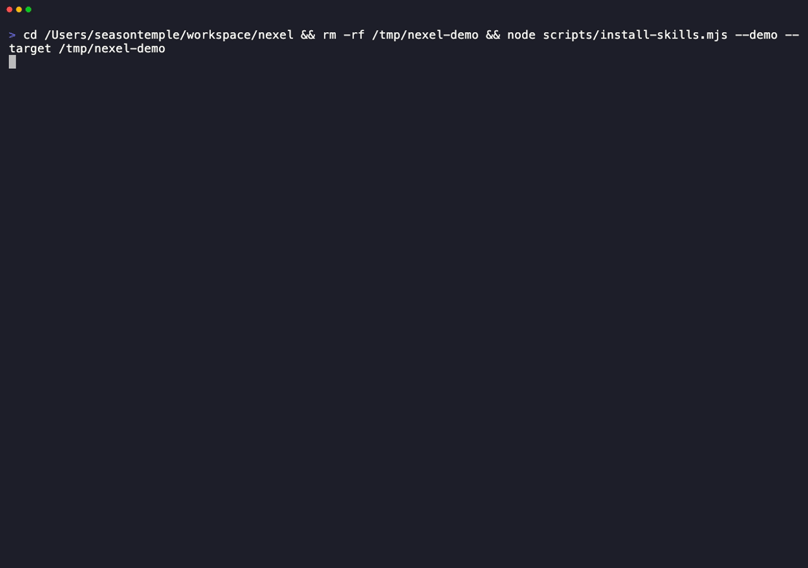

# sample-product

This directory is the runnable downstream-product example for `nexel`.
It shows how a product supplies identity, content, and a thin bin while the
installer kernel owns validation, planning, install, state, update, and repair.

## Files

```text
examples/sample-product/
├── agent-skills.config.mjs    # ProductConfig: product name, id prefixes, bin name, env names
├── sample.install.json        # Manifest: installable skills, agents, rules, and bundles
├── skills/                    # Skill source directories
├── agents/                    # Agent source files
├── rules/                     # Rule source files
├── bin.mjs                    # Real product bin wrapping createCli()
└── *.test.mjs                 # Spawn-based example and plugin tests
```

## Run the visual install demo

From the repository root:

```sh
node scripts/install-skills.mjs
```



The GIF is recorded from the real command above via `npm run demo:gif`. The
demo reuses this sample product and shows the formal installer flow: choose
install / uninstall / lifecycle, choose one or more target agent CLIs (Claude
Code, Codex, OpenCode), choose a manifest bundle or skill, preview the plan,
then write or remove managed files. It writes only to sandbox targets under the
demo root, not to real `~/.codex`, `~/.claude`, or OpenCode config directories.

The visual flow shows:

```text
1. Load ProductConfig from examples/sample-product/agent-skills.config.mjs
2. Load manifest from examples/sample-product/sample.install.json
3. Choose action: install / uninstall / lifecycle
4. Choose target agent CLI(s): claude-code / codex / opencode
5. Resolve selection
6. Build install/uninstall plan for the sandbox target(s)
7. Stage/promote files or remove managed files
8. Write managed state to each agent target's .nexel/state.json
```

To inspect the installed files:

```sh
rm -rf /tmp/nexel-demo
node scripts/install-skills.mjs --demo --yes --target /tmp/nexel-demo --agent codex
find /tmp/nexel-demo -maxdepth 4 -type f -print
```

To demo install and uninstall in one safe run:

```sh
rm -rf /tmp/nexel-demo
node scripts/install-skills.mjs --demo --action lifecycle --agent codex --target /tmp/nexel-demo
```

To clean the demo area:

```sh
rm -rf /tmp/nexel-demo
find "${TMPDIR:-/tmp}" -maxdepth 1 -type d -name 'nexel-demo-*' -prune -exec rm -rf {} +
rm -f nexel-*.tgz nexel-*.tgz.sha256
```

For a non-interactive smoke test:

```sh
node scripts/install-skills.mjs --demo --yes --json --cleanup --action lifecycle --agent codex
```

## Drive the sample bin directly

`bin.mjs` is what a real downstream product would publish as its executable:

```sh
node examples/sample-product/bin.mjs help
node examples/sample-product/bin.mjs list --json
node examples/sample-product/bin.mjs plan --target /tmp/nexel-demo --bundle sample-demo
node examples/sample-product/bin.mjs install --target /tmp/nexel-demo --bundle sample-demo --yes
```

The root `scripts/install-skills.mjs` convenience script forwards ordinary
verbs such as `list`, `plan`, `install`, and `doctor` to this bin. Its no-arg
mode only adds the visual demo wrapper around the same kernel path.
